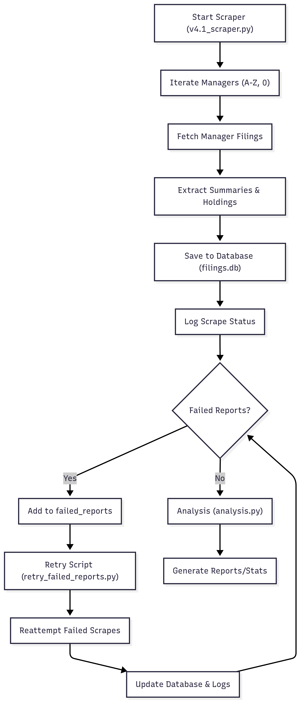
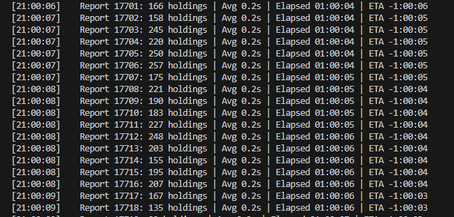
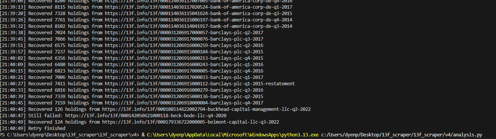

# 13F Scraper

This scraper extracts **summaries** and **detailed holdings** from [13f.info](https://13f.info), saving them into a local SQLite database (`out/filings.db`).

It is designed to be:
- ✅ **Resume-friendly** (continues where it left off)
- ✅ **Letter-by-letter** (A → Z → 0) for quicker results
- ✅ **Threaded** (parallel scraping with `ThreadPoolExecutor`)
- ✅ **Deduplicated** (via UNIQUE index on `(ReportLink, Symbol)`)
- ✅ **Logged** (`scrape_log` table records skipped, scraped, and failed reports)
- ✅ **Recoverable** (`failed_reports` table for reattempts with a helper script)

---

## 🗂️ Codebase Structure & Workflow

### File Overview

- **v4.1_scraper.py:**  
	Main scraper. Iterates through managers, fetches filings, extracts and saves summaries/holdings, logs all activity, and records failures for retry.

- **retry_failed_reports.py:**  
	Reattempts scraping for reports that previously failed. Updates database and logs accordingly.

- **analysis.py:**  
	Analyzes the scraped data, generating reports and statistics from the database.

### Workflow Diagram



### Dependencies

- `requests`, `bs4` (BeautifulSoup), `sqlite3`, `concurrent.futures`, `threading`, `os`, `time`, `tabulate`
- Output: SQLite database ([`out/filings.db`](out/filings.db))

### Input/Output

- **Input:** No external input; scrapes directly from [13f.info](https://13f.info)
- **Output:**
	- Database tables: `summaries`, `holdings`, `failed_reports`, `scrape_log`
	- Analysis output: Reports/statistics (via `analysis.py`)

---

## 📂 Database Structure

### `summaries`
Stores summary info for each manager and quarter.

| Column       | Description                         |
|--------------|-------------------------------------|
| Manager      | Manager URL                         |
| Quarter      | Quarter (e.g., Q1 2023)             |
| HoldingsCount| Count of holdings                   |
| Value        | Total portfolio value               |
| TopHoldings  | Top holdings string                 |
| Form         | Filing form type                    |
| DateFiled    | Filing date                         |
| FilingID     | SEC filing ID                       |
| ReportLink   | Report URL                          |

---

### `holdings`
Stores individual stock holdings per report.

| Column      | Description                         |
|-------------|-------------------------------------|
| Symbol      | Stock ticker                        |
| IssuerName  | Issuer name                         |
| Class       | Class of stock                      |
| CUSIP       | CUSIP identifier                    |
| Value       | Value ($000)                        |
| Percent     | % of portfolio                      |
| Shares      | Number of shares                    |
| Principal   | Principal amount                    |
| OptionType  | Option type (if any)                |
| ReportLink  | Link to report (foreign key)        |
| Manager     | Manager URL                         |
| Quarter     | Quarter                             |

---

### `failed_reports`
Holds reports that failed scraping (server errors, missing JSON, etc.).

| Column      | Description                         |
|-------------|-------------------------------------|
| ReportLink  | Report URL (primary key)            |
| Manager     | Manager URL                         |
| Quarter     | Quarter                             |
| Error       | Error message                       |
| LastTried   | Last retry timestamp                |

---

### `scrape_log`
Audit log of scraping activity.

| Column      | Description                         |
|-------------|-------------------------------------|
| ReportLink  | Report URL                          |
| Status      | `scraped`, `skipped`, or `failed`   |
| Timestamp   | Auto timestamp of event             |

---

## 🚀 Usage

### Run main scraper
```bash
python scraper_v4.py
```
- Starts at letter A, moves through Z, then 0.
- Skips already scraped reports.
- Saves summaries and holdings into filings.db.
- Logs every attempt into scrape_log.

### Retry failed reports

```bash
python retry_failed_reports.py
```

- Loads entries from failed_reports.
- Reattempts scraping.
- If successful → inserts holdings + removes from failed_reports.
- If still failing → keeps it in failed_reports, updates LastTried.

## ⚡ Key Features

- Parallel scraping → Scrapes up to 12 reports at once.
- Batch database writes → Reduces I/O overhead.
- Resume support → Restarts where it left off.
- Deduplication → Prevents duplicate holdings via UNIQUE index.
- Logging → Tracks skipped/successful/failed reports.

## Example outputs

### Scraping


### Recovering
